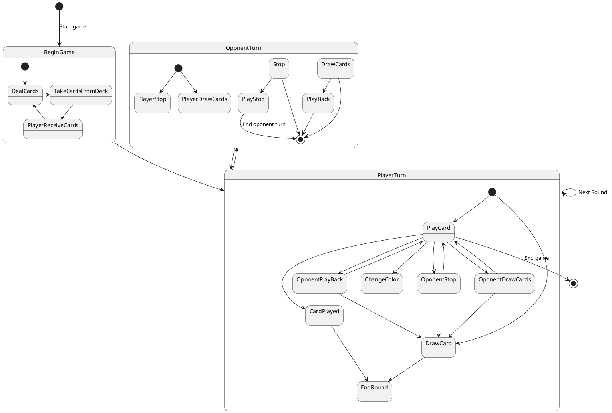

# This is traditional card game It's raining

# Game State Diagram

```plantuml
@startuml
[*] --> BeginGame : Start game
state BeginGame {
[*] --> DealCards
DealCards-> TakeCardsFromDeck
TakeCardsFromDeck --> PlayerReceiveCards 
PlayerReceiveCards --> DealCards
}

BeginGame --> PlayerTurn 

state PlayerTurn {
    [*] --> PlayCard
    [*] --> DrawCard
    DrawCard --> EndRound
    PlayCard --> OponentStop
    PlayCard --> OponentDrawCards
    PlayCard --> ChangeColor
    PlayCard --> CardPlayed
    OponentStop--> PlayCard
    OponentStop --> DrawCard
    OponentDrawCards --> PlayCard
    OponentDrawCards --> DrawCard
    PlayCard --> OponentPlayBack
    OponentPlayBack --> DrawCard
    OponentPlayBack --> PlayCard
    CardPlayed--> EndRound
}
PlayCard --> [*] : End game
PlayerTurn --> PlayerTurn : Next Round

state OponentTurn {
    [*] --> PlayerStop
    [*] --> PlayerDrawCards
    Stop --> PlayStop
    DrawCards --> PlayBack
    DrawCards --> [*]
    PlayBack --> [*]
    Stop --> [*]
    PlayStop --> [*] : End oponent turn
}

PlayerTurn --> OponentTurn
OponentTurn --> PlayerTurn
@enduml
```